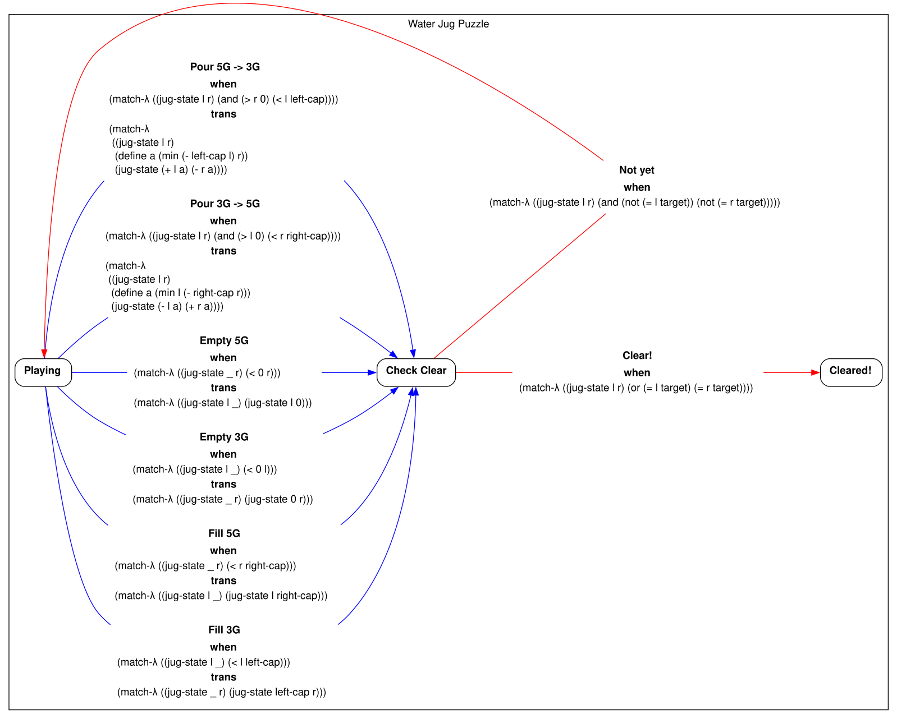
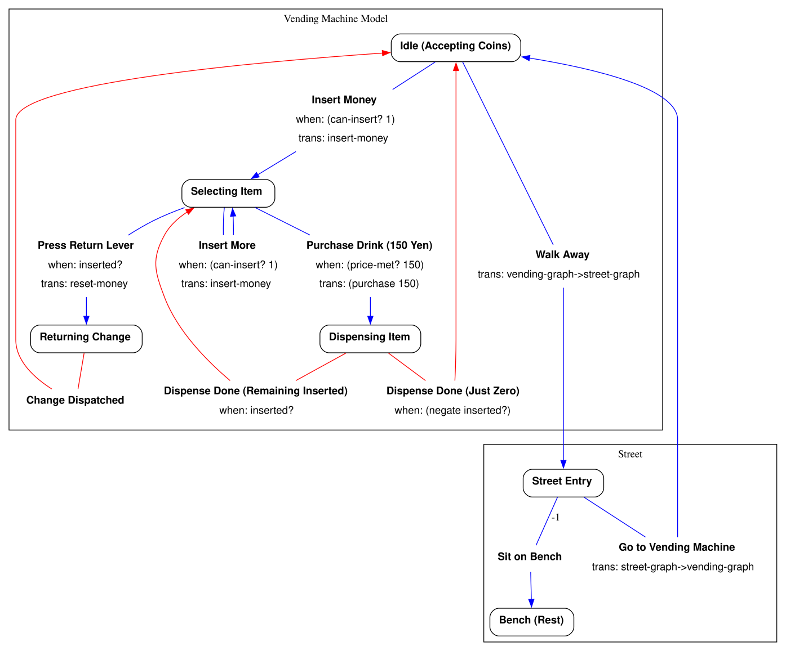

graph-executor
==============

A Typed Racket library for modeling, executing, visualizing, and model-checking directed graphs.

> ⚠️ **Experimental:** This library has not reached v1.0.0 yet. Breaking changes may occur in future updates. 

## Key Features

- **Unified Model**: Define a model once to enable execution, visualization, and model checking.
- **Modular Composition**: Build independent graphs with different state types, then connect them into a single model.
- **Reproducible Execution**: Every run is deterministic and can be replayed from journals.
- **Deterministic Replay of I/O**: Use `prompt` (input) and `message` (output) inside transitions; replaying with a journal remains a pure, deterministic function.
- **Graph Visualization**: Render models to Graphviz (DOT) and highlight execution paths from journals.
- **Model Checking**: Detects deadlocks, livelocks, and invariant violations across states and `prompt` branches, outputting counterexamples as journals.

## Under the Hood

- **Journal-Driven Design**: Journals are core data structures, not just logs. They power deterministic replay, visualization, and counterexample generation.
- **Powered by Delimited Continuations**: Uses Racket's delimited continuations (`call-with-composable-continuation`) to implement internal effects like state, event logging (`emitter`), and nondeterministic computation (`amb`).
- **Dual Code Representation**: The `code` macro captures both executable functions and their S-expressions, keeping execution logic and DOT visualization in sync.
- **Zero Third-Party Dependencies**: Built only with standard Typed Racket. It requires no external packages.

## Installation

Install the library directly from GitHub using `raco`:

```shell
raco pkg install https://github.com/tojoqk/graph-executor.git
```

## Quick Start: The Water Jug Puzzle



Here is a complete example of the classic Water Jug Puzzle (measuring exactly 4 gallons using 3-gallon and 5-gallon jugs).

This single file shows how to:
- Define states and transitions.
- Draw the graph with Graphviz (DOT).
- Play the game in your terminal.
- Test the model and find the shortest path automatically.

```racket
#lang typed/racket

(require graph-executor)

(struct jug-state ([left : Integer] [right : Integer])
  #:type-name Jug-State
  #:transparent)

(: jug-graph (-> String Positive-Integer Positive-Integer Positive-Integer
                 (Values (Graph Jug-State) (Node Jug-State))))
(define (jug-graph g left-cap right-cap target)
  (when (= left-cap right-cap)
    (error 'jug-graph "must not be same caps (~a, ~a)" left-cap right-cap))

  (: pour-left-to-right/message (-> Jug-State Any))
  (define (pour-left-to-right/message st)
    (let ([amount (min (jug-state-left st) (- right-cap (jug-state-right st)))])
      (message (format "Poured ~a gallons from ~aG to ~aG." amount left-cap right-cap))))

  (: pour-right-to-left/message (-> Jug-State Any))
  (define (pour-right-to-left/message st)
    (let ([amount (min (jug-state-right st) (- left-cap (jug-state-left st)))])
      (message (format "Poured ~a gallons from ~aG to ~aG." amount right-cap left-cap))))

  (: prompt-playing (-> Jug-State String))
  (define (prompt-playing st)
    (format "Goal: Make exactly ~aG\n  Current Status:\n    [ ~aG Jug: ~a/~a | ~aG Jug: ~a/~a ]\n  What will you do?"
            target
            left-cap (jug-state-left st) left-cap
            right-cap (jug-state-right st) right-cap))

  (define node (inst (node-maker g) Jug-State (U 'puzzle 'check 'terminal)))
  (define edge (inst make-edge Jug-State))
  (define graph (inst make-graph Jug-State))

  (define playing (node "Playing" #:type 'puzzle #:prompt (code prompt-playing)))
  (define check   (node "Check Clear" #:type 'check))
  (define cleared (node "Cleared!"
                        #:type 'terminal
                        #:before
                        (code
                         (lambda (_)
                           (message
                            (format "Congratulations! You made exactly ~a gallons!" target))))))

  (values
   (graph g
          #:edges
          (list
           (edge (format "Fill ~aG" left-cap) #:from playing #:to check
                 #:when (code (match-λ [(jug-state l _) (< l left-cap)]))
                 #:trans (code (match-λ [(jug-state _ r) (jug-state left-cap r)]))
                 #:before (code (lambda (_)
                                  (message (format "Filled the ~a-gallon jug." left-cap)))))
           (edge (format "Fill ~aG" right-cap) #:from playing #:to check
                 #:when (code (match-λ [(jug-state _ r) (< r right-cap)]))
                 #:trans (code (match-λ [(jug-state l _) (jug-state l right-cap)]))
                 #:before (code (lambda (_)
                                  (message (format "Filled the ~a-gallon jug." right-cap)))))
           (edge (format "Empty ~aG" left-cap) #:from playing #:to check
                 #:when (code (match-λ [(jug-state l _) (< 0 l)]))
                 #:trans (code (match-λ [(jug-state _ r) (jug-state 0 r)]))
                 #:before (code (lambda (_)
                                  (message (format "Emptied the ~a-gallon jug." left-cap)))))
           (edge (format "Empty ~aG" right-cap) #:from playing #:to check
                 #:when (code (match-λ [(jug-state _ r) (< 0 r)]))
                 #:trans (code (match-λ [(jug-state _ r) (jug-state 0 r)]))
                 #:before (code (lambda (_)
                                  (message (format "Emptied the ~a-gallon jug." right-cap)))))
           (edge (format "Pour ~aG -> ~aG" left-cap right-cap) #:from playing #:to check
                 #:when (code (match-λ [(jug-state l r) (and (> l 0) (< r right-cap))]))
                 #:trans (code (match-λ [(jug-state l r)
                                          (define a (min l (- right-cap r)))
                                          (jug-state (- l a) (+ r a))]))
                 #:before (code pour-left-to-right/message))
           (edge (format "Pour ~aG -> ~aG" right-cap left-cap) #:from playing #:to check
                 #:when (code (match-λ [(jug-state l r) (and (> r 0) (< l left-cap))]))
                 #:trans (code (match-λ [(jug-state l r)
                                          (define a (min (- left-cap l) r))
                                          (jug-state (+ l a) (- r a))]))
                 #:before (code pour-right-to-left/message))
           (edge "Not yet" #:mode 'auto #:from check #:to playing
                 #:when (code (match-λ [(jug-state l r) (and (not (= l target))
                                                              (not (= r target)))])))
           (edge "Clear!" #:mode 'auto #:from check #:to cleared
                 #:when (code (match-λ [(jug-state l r) (or (= l target)
                                                             (= r target))])))))
   playing))

(module+ model
  (provide make-model)
  (: make-model (-> Positive-Integer Positive-Integer Positive-Integer (Model Jug-State)))
  (define (make-model left-cap right-cap target)
    (model
     (thunk
      (define-values (graph node-init) (jug-graph "Water Jug Puzzle" left-cap right-cap target))
      (values (list graph) node-init (jug-state 0 0))))))

(module+ main
  (require racket/cmdline
           (submod ".." model))

  (: mode (Boxof (U 'dot 'console 'random)))
  (define mode (box 'dot))

  (define program-name "water-jug")
  (command-line
   #:program program-name
   #:once-any
   [("--dot") "Generate dot" (set-box! mode 'dot)]
   [("--console") "Run console" (set-box! mode 'console)]
   [("--random") "Run random" (set-box! mode 'random)]
   #:args ()
   (define m (make-model 3 5 4))
   (case (unbox mode)
     [(dot) (render-dot m
                        #:config (dot-config #:global
                                             (dot-global-config #:rankdir 'LR)))]
     [(console)
      (writeln (console-run m #:config (console-config
                                        #:commands (list (list 'quit 'q "Quit"))
                                        #:trace-display 'hide)))]
     [(random)
      (define j (console-run m #:config (console-config
                                         #:chooser (lambda (_) 'random)
                                         #:trace-display 'hide)))
      (displayln "---------")
      (printf "Solved in ~a steps!\n"
              (count (lambda ([e : Journal-Entry]) (eq? (car e) 'choose)) j))])))

(module+ test
  (require typed/rackunit (submod ".." model))

  (define m (make-model 3 5 4))

  (: terminal-node? (-> Node-Info Boolean))
  (define (terminal-node? x) (eq? (node-info-type x) 'terminal))

  (check-false (find-livelock m))
  (check-false (find-deadlock m terminal-node?))
  (check-false (find-false-terminal m terminal-node?))
  (check-false (find-auto-conflict m))
  (check-false (find-counterexample m (match-λ* [(list _ (jug-state l r))
                                                  (and (<= 0 l 3)
                                                       (<= 0 r 5))])))

  (: shortest-path (-> (Model Jug-State) (Option Journal)))
  (define (shortest-path m)
    (let loop : (Option Journal) ([depth : Natural 0])
      (find-deadlock m (const #f)
                     #:bound depth
                     #:bounded (thunk (loop (add1 depth))))))

  (check-equal? (shortest-path m)
                '((auto ("Clear!"))
                  (choose ("Pour 5G -> 3G"))
                  (auto ("Not yet"))
                  (choose ("Fill 5G"))
                  (auto ("Not yet"))
                  (choose ("Pour 5G -> 3G"))
                  (auto ("Not yet"))
                  (choose ("Empty 3G"))
                  (auto ("Not yet"))
                  (choose ("Pour 5G -> 3G"))
                  (auto ("Not yet"))
                  (choose ("Fill 5G")))))
```

Draw the graph with Graphviz:

```shell
racket examples/simple-water-jug.rkt --dot | dot -Tpng -o water-jug.png
```


Play the game in your terminal:

```shell
racket examples/simple-water-jug.rkt --console
```

<details><summary>See console output: Interactive gameplay and the final Journal</summary>

```

* Goal: Make exactly 4G
  Current Status:
    [ 3G Jug: 0/3 | 5G Jug: 0/5 ]
  What will you do?
  - [1] Fill 3G
  - [2] Fill 5G
  - [q] Quit
? 1

Filled the 3-gallon jug.

* Goal: Make exactly 4G
  Current Status:
    [ 3G Jug: 3/3 | 5G Jug: 0/5 ]
  What will you do?
  - [1] Fill 5G
  - [2] Empty 3G
  - [3] Pour 3G -> 5G
  - [q] Quit
? 3

Poured 3 gallons from 3G to 5G.

* Goal: Make exactly 4G
  Current Status:
    [ 3G Jug: 0/3 | 5G Jug: 3/5 ]
  What will you do?
  - [1] Fill 3G
  - [2] Fill 5G
  - [3] Empty 5G
  - [4] Pour 5G -> 3G
  - [q] Quit
? 1

Filled the 3-gallon jug.

* Goal: Make exactly 4G
  Current Status:
    [ 3G Jug: 3/3 | 5G Jug: 3/5 ]
  What will you do?
  - [1] Fill 5G
  - [2] Empty 3G
  - [3] Empty 5G
  - [4] Pour 3G -> 5G
  - [q] Quit
? 4

Poured 2 gallons from 3G to 5G.

* Goal: Make exactly 4G
  Current Status:
    [ 3G Jug: 1/3 | 5G Jug: 5/5 ]
  What will you do?
  - [1] Fill 3G
  - [2] Empty 3G
  - [3] Empty 5G
  - [4] Pour 5G -> 3G
  - [q] Quit
? 3

Emptied the 5-gallon jug.

* Goal: Make exactly 4G
  Current Status:
    [ 3G Jug: 1/3 | 5G Jug: 0/5 ]
  What will you do?
  - [1] Fill 3G
  - [2] Fill 5G
  - [3] Empty 3G
  - [4] Pour 3G -> 5G
  - [q] Quit
? 4

Poured 1 gallons from 3G to 5G.

* Goal: Make exactly 4G
  Current Status:
    [ 3G Jug: 0/3 | 5G Jug: 1/5 ]
  What will you do?
  - [1] Fill 3G
  - [2] Fill 5G
  - [3] Empty 5G
  - [4] Pour 5G -> 3G
  - [q] Quit
? 1

Filled the 3-gallon jug.

* Goal: Make exactly 4G
  Current Status:
    [ 3G Jug: 3/3 | 5G Jug: 1/5 ]
  What will you do?
  - [1] Fill 5G
  - [2] Empty 3G
  - [3] Empty 5G
  - [4] Pour 3G -> 5G
  - [q] Quit
? 4

Poured 3 gallons from 3G to 5G.

Congratulations! You made exactly 4 gallons!

* Choose:
  - [q] Quit
? q
((auto ("Clear!")) (choose ("Pour 3G -> 5G")) (auto ("Not yet")) (choose ("Fill 3G")) (auto ("Not yet")) (choose ("Pour 3G -> 5G")) (auto ("Not yet")) (choose ("Empty 5G")) (auto ("Not yet")) (choose ("Pour 3G -> 5G")) (auto ("Not yet")) (choose ("Fill 3G")) (auto ("Not yet")) (choose ("Pour 3G -> 5G")) (auto ("Not yet")) (choose ("Fill 3G")))
```

</details>

Run tests and model checking:

```shell
raco test examples/simple-water-jug.rkt
```

## More Examples: The Vending Machine



The [examples/vending-machine.rkt](examples/vending-machine.rkt) model shows two advanced features:

- **Connecting Graphs with Different States**: Connects independent graphs that have different state types (`Street-State` and `Vending-Machine-State`) into a single model using `OpenGraph` and `Bridge`.
- **Safe Inputs and Outputs (`prompt` and `message`)**: Transitions can ask the user "How much?" using `prompt`. In the console, this is real I/O. But every choice is saved in a `Journal`. This makes replaying a pure function. The model checker can safely test all possible inputs to find bugs.

## License

Apache License 2.0. See [LICENSE](LICENSE) for details.
